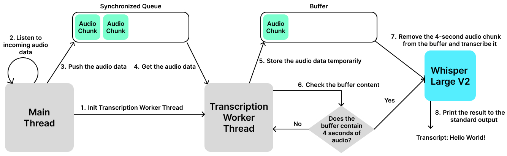
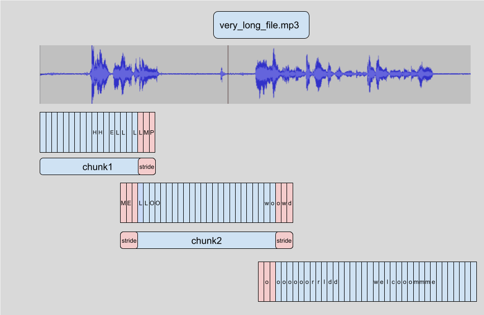
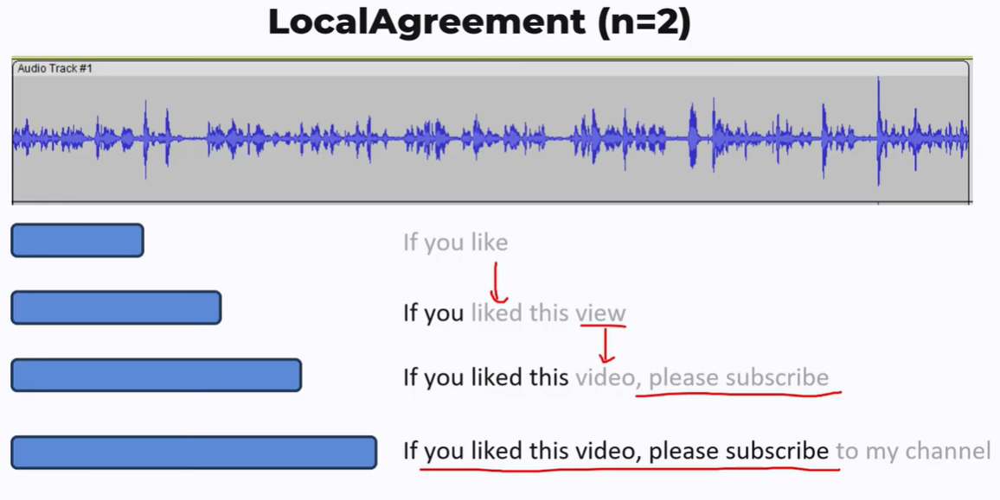
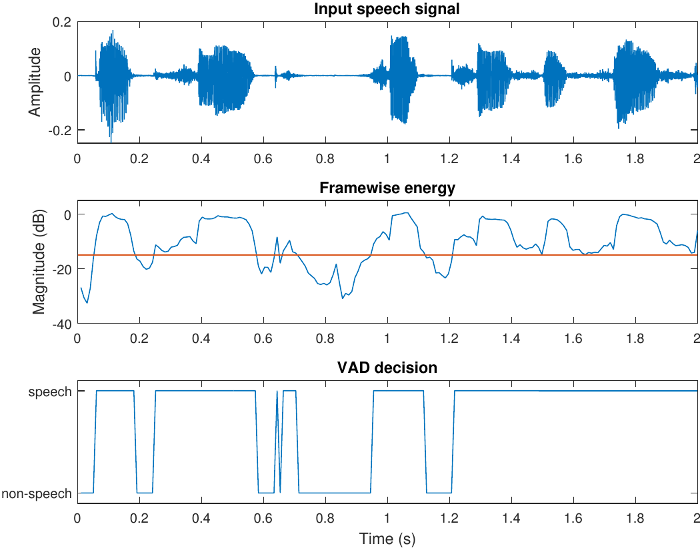

# Live Transcription Application with LLMs

A simple application that provides real-time transcription of audio using Large Language Models (LLMs). This project is designed to demonstrate practical skills in modern speech and language model optimization along with the integration to build a real-time artificial intelligence (AI) application.

## Model Optimization

The goal of model optimization is to adapt or optimize a pre-trained speech model for efficiency.

### Model Benchmarking

There are various open-source models available for speech recognition. However, they may not be optimized for real-time applications. Benchmarking these models helps identify their performance in terms of speed and word error rate (WER). To achieve this, I use [openslr/librispeech_asr](https://huggingface.co/datasets/openslr/librispeech_asr) dataset, which is a popular dataset for training and evaluating automatic speech recognition (ASR) systems. The following table summarizes the benchmarking results of two models, which are run on a single P100 GPU with 16GB of memory and on 1000 samples from the dataset.

> Note: Word error rate (WER) is a common metric used to evaluate the performance of speech recognition systems. It indicates the average number of errors per reference word. The lower the value, the better the performance of the ASR system with a WER of 0 being a perfect score.

| Model                                                                                   | Average Speed (seconds) | Average WER | GPU Memory Usage (MB) |
|-----------------------------------------------------------------------------------------|-------------------------|-------------|-----------------------|
| [mistralai/Voxtral-Mini-3B-2507](https://huggingface.co/mistralai/Voxtral-Mini-3B-2507) | 2.02348                 | 4.00743     | 9195 MiB              |
| [openai/whisper-large-v2](https://huggingface.co/openai/whisper-large-v2)               | 1.65714                 | 4.45063     | 6149 MiB              |

> The following models are not included in the benchmarking table due to issues:
> [microsoft/wavlm-base](https://huggingface.co/microsoft/wavlm-base) requires additional fine-tuning on labeled text data to use it as a speech recognition model.
> The [google/gemma-3n-E2B-it](https://huggingface.co/google/gemma-3n-E2B-it) model somehow have a problem when running on GPU.

### Documentation

1. Why did you choose your specific model and optimization technique (LoRA or Quantization)?

= The main factors to consider when choosing a model for a real-time transcription application are speed, performance, and resource requirements. An ideal model should be able to transcribe audio quickly while maintaining a low word error rate (WER) and requiring minimal GPU memory. However, this is usually not the case. Thus, we need to consider trade-offs between these factors and choose a model that best fits the application's requirements. Based on the previous benchmarking, we can see that the [openai/whisper-large-v2](https://huggingface.co/openai/whisper-large-v2) model is a good candidate for real-time transcription as it has a good balance of speed and WER.

In addition, we can apply various optimization techniques to further improve the model's efficiency, such as LoRA (Low-Rank Adaptation), quantization, or inference optimization with ONNX Runtime. For this use case, I chose to apply quantization to the model, as it reduces the model size and memory usage while maintaining a good level of performance. On the other hand, LoRA is more suitable for fine-tuning tasks where we want to adapt the model to a specific domain, such as handling indonesian or local languages. Furthermore, regarding ONNX, it requires converting the model to ONNX format and additional steps to optimize it for inference, which add complexity to the process. Thus, I chose to apply quantization to the model to support real-time transcription.

1. Explain the core concept behind the technique you chose. How does it reduce the computational or memory footprint of a large model?

= Quantization is a technique that reduces the precision of the model's weights and activations, which in turn reduces the model size and memory usage. This is achieved by converting the model's weights from high-precision floating-point numbers (e.g., 32-bit) to lower-precision formats (e.g., 8-bit integers). This reduces the amount of memory required to store the model and speeds up inference by computing with lower-precision data types, which are generally faster to process on modern hardware.

1. What are the potential trade-offs of using this technique (e.g., performance drop, accuracy changes)?

= The main trade-off of using quantization is the potential drop in model accuracy. Reducing the precision of the weights and activations can lead to a loss of information, which may negatively impact the model's performance on certain tasks. However, with careful quantization and calibration, such as using GPTQ, it is possible to minimize the impact on accuracy while still achieving significant reductions in model size and memory usage. In practice, the trade-off between model size and accuracy should be carefully evaluated. Therefore, I provide a similar benchmarking table for the quantized model to compare its performance with the original model as follows:

| Model                                                                     | Average Speed (seconds) | Average WER | GPU Memory Usage (MB) |
|---------------------------------------------------------------------------|-------------------------|-------------|-----------------------|
| [openai/whisper-large-v2](https://huggingface.co/openai/whisper-large-v2) | 1.65714                 | 4.45063     | 6149 MiB              |
| `openai/whisper-large-v2` 4-bit quantized                                 | 2.02327                 | 4.50742     | 2157 MiB              |

> Note: The 4-bit quantized model is slightly slower than the original model due to the additional computation required for dequantization when processing the input data. However, it uses significantly less GPU memory, which is beneficial for running the model on devices with limited resources.
> In addition, `bitsandbytes` quantization is applied at runtime, which means that the model is not permanently quantized. The `save_pretrained` method does not save the quantized model, only the original model. Thus, we need to apply quantization at runtime when loading the model.

## Real-Time Streaming Transcription

The application leverages the capabilities of the quantized Whisper model to provide real-time transcription of audio streams. Simply put, the application consists of the following processes:

1. Captures audio from a microphone in chunks.
2. Processes these audio chunks using a speech-to-text model.
3. Displays the transcribed text to the user in (near) real-time.

> Note: The quantized model is used to reduce the GPU memory requirements, allowing the application to run on RTX 3050 with 4GB of memory.

### System Architecture

The simplest architecture for the application consists of a single thread that captures audio from the microphone and another thread to process the audio chunks and perform transcription. The visual representation of the architecture is as follows:

This program uses several Python libraries to handle real-time audio transcription:

- **`queue`** and **`threading`**: Standard Python libraries that enable safe communication and concurrent processing between threads.

- **`numpy`**: Used for efficient numerical operations on audio data arrays.

- **`sounddevice`**: Provides an interface for capturing audio from the microphone in real time.

- **`torch`**  
  The core PyTorch library for tensor operations and model inference on CPU or GPU.

- **`transformers`**  
  - **`WhisperProcessor`**: Preprocesses raw audio into model-ready input.  
  - **`WhisperForConditionalGeneration`**: Generates transcriptions using OpenAI’s Whisper model.  
  - **`BitsAndBytesConfig`**: Helps configure memory-efficient model loading, useful for handling large models on limited hardware.

### Documentation

1. What are the main challenges in building a low-latency streaming transcription system?
= The main challenges lie in ensuring low latency and high throughput, while maintaining accuracy. This involves efficiently capturing audio data, processing it in real-time, and minimizing the time taken for transcription. To overcome these challenges, we need to choose an efficient model that can handle real-time transcription, such as the quantized Whisper model, and implement a robust and efficient audio processing pipeline.

2. How did you handle the continuous flow of audio data? Explain your strategy for segmenting or buffering the audio.
= The continuous flow of audio data is handled using a thread-safe queue to collect audio chunks. The audio is captured in small blocks by the main thread and added to the queue. A separate thread then collects these audio chunks from the queue to a buffer, which is then processed in chunks of a fixed duration (e.g., 4 seconds). This allows for real-time processing while accommodating variations in audio input.

1. If you were to improve your system for a production environment, what are two improvements you would make?
= The current implementation still lacks a robust and efficient audio processing pipeline. The two major issues are the processing of non-overlapping audio chunks and the lack of a mechanism to handle unvoiced audio. For non-overlapping audio chunks, this caused the model to miss some words, especially those at the end of each chunk, which can lead to incomplete transcriptions. For unvoiced audio, the model may produce random transcriptions, as it does not handle silence or unvoiced audio properly.

To handle these issues, I would implement the following improvements:

1. **Overlapping Audio Chunks**: Implement a mechanism to process audio chunks with some overlap, allowing the model to capture words that may be at the end of each chunk more accurately. This can be achieved by implementing the following more advanced audio processing algorithm:

   - Chunk and Stride: Instead of processing fixed-size chunks, we can process overlapping chunks with a stride.

   

   > Source: <https://huggingface.co/blog/asr-chunking>

   - Local Agreement: Use a local agreement mechanism to combine the transcriptions of overlapping chunks. This involves comparing the transcriptions of overlapping segments and selecting the most likely transcription.

   

   > Source: <https://youtu.be/_spinzpEeFM?si=rS5n9ChxQcDPHqfD>

2. **Unvoiced Audio Handling**: Implement a mechanism to handle unvoiced audio, such as silence or background noise, to prevent the model from producing random transcriptions. This can be achieved by using a voice activity detection (VAD) algorithm to detect unvoiced audio and skip processing those segments.

    

    > Source: <https://speechprocessingbook.aalto.fi/Recognition/Voice_activity_detection.html>

To implement all of this, we would need a solid understanding of audio processing and speech language models. However, I do realize that this is beyond of my current skill set and understanding. Thus, I would need to learn more about audio processing and speech language models to implement these improvements effectively in the future.

## Challenges Encountered

1. Incompatibility with certain models when using GPU, such as the [openai/whisper-large-v2](https://huggingface.co/openai/whisper-large-v2) model, which may be caused by runtime or dependency issues.
2. Challenges running the code on platforms like Google Colab and Kaggle, primarily due to package version conflicts and incompatibility with the latest library versions required by the project.
3. [Error when using `load_in_8bit` on Kaggle's P100 GPU.](https://github.com/bitsandbytes-foundation/bitsandbytes/issues/538).
4. Unexpected events hindered the development process, such as revising my research paper for [ARR](https://aclrollingreview.org/) (due on 29 July), which required significant time and effort and led to delays in starting the project.
5. Complex speech processing algorithms, such as overlapping audio chunks and local agreement, which require a solid understanding of audio processing and speech language models. I realized that I need to learn more about these topics in the future.
